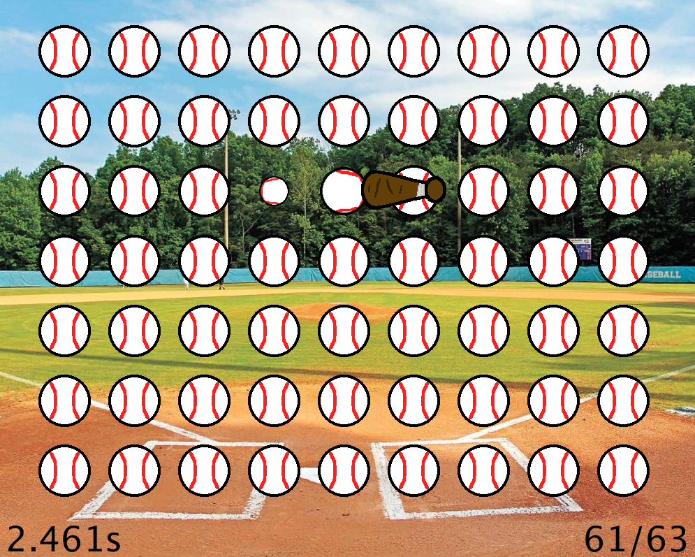

# processing-baseballer

## Concept

A fun point and click game where the batter needs to hit all baseballs in the fastest time!

## Usage

Navigate to ```baseballer/baseballer.pde``` and open with the Processing IDE.

Run in the Processing IDE or export to an application and execute to play.

Click on baseballs to progress. Hit all baseballs to finish a run.

## Demo Image


